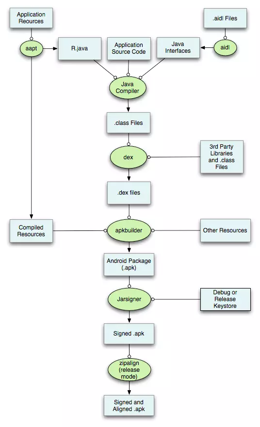
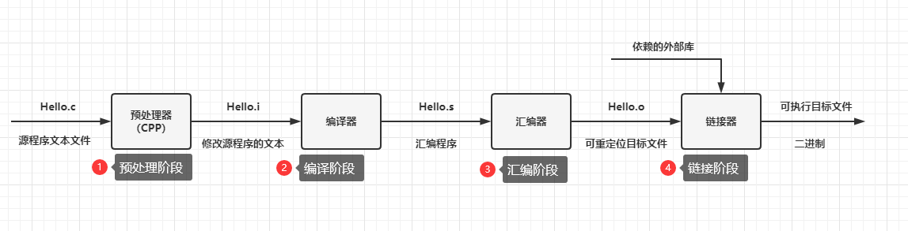
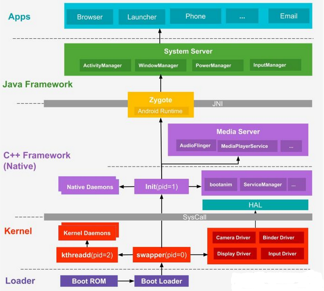
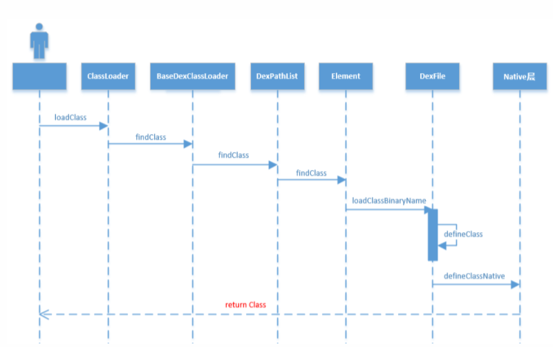
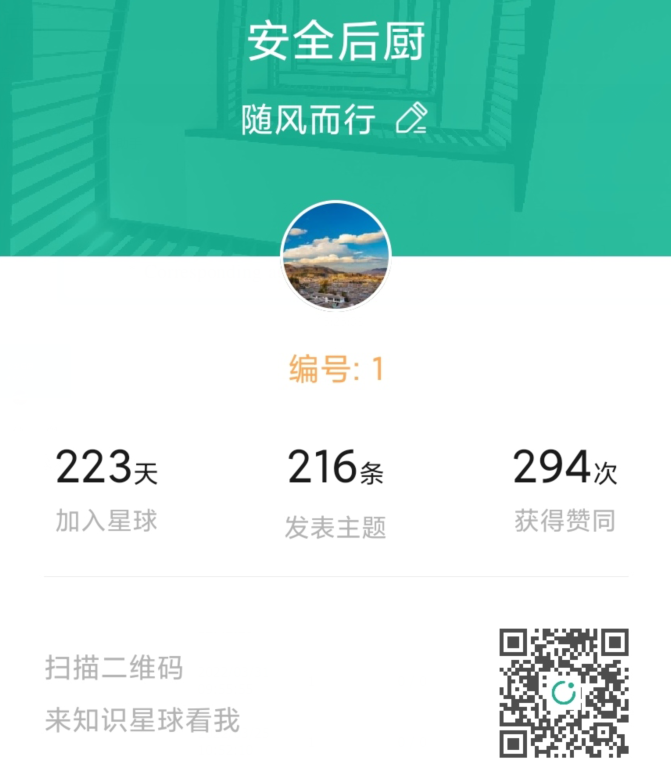

# Android逆向篇——加载流程面试点（随风而行aa）

本文主要讲解Android逆向中的Android APK编译流程、编译原理、Android 系统加载流程、Android APP启动流程、Android APP类加载机制。

## 一、Android APK编译流程

我们用一张图来描述apk的构建流程：



上述的步骤为：

**（1）aapt打包资源文件**

资源文件（res文件夹下的文件）通过aapt打包生成R.java(资源索引文件)、arsc资源文件和res文件

**（2）处理aidl files**

AIDL是Android接口定义语言，是Android提供的IPC的一种独特实现，这里生成对应的Java接口文件

**（3）编译**

使用javac将R.java文件、工程源码文件、aidl.java文件编译成.class文件

**（4）生成dex文件**

源码.class文件和第三方jar或者library通过dx工具打包成dex文件

**（5）apkbuilder（生成未签名apk）**

将classes.dex、resources.arsc、res文件夹(res/raw资源被原装不动地打包进APK之外，其它的资源都会被编译或者处理)、Other Resources(assets文件夹)、AndroidManifest.xml打包成apk文件

**（6）对apk文件进行签名**

apksigner工具会对未签名的apk验证签名。得到一个签名后的apk（signed.apk）

**（7）zipalign（对齐）**

release mode 下使用 aipalign进行align，即对签名后的apk进行对齐处理，以便2可以通过内存映射来访问

上面过程则完成了Android中的apk的编译流程，但是步骤（4）中将so库进行打包，这里so库一般存放在lib文件夹下，Android一般通过ndk将c/c++代码编译为so文件，这里我们可以详细了解一下编译原理。

详细参考博客：[Android APK编译流程](https://cloud.tencent.com/developer/article/1920027)

## 二、编译原理



我们可以借助gcc来实现上面的过程：

**（1）预处理阶段**

预处理器（cpp）根据以字符``#开头的命令修给原始的C程序，结果得到另一个C程序，通常以.i作为文件扩展名。主要是进行文本替换、宏展开、删除注释这类简单工作。

```
命令行：gcc -E hello.c hello.i
```

考点经常问include在哪个阶段处理，就是该阶段

**（2）编译阶段**

将文本文件hello.i翻译成hello.s，包含相应的汇编语言程序

**（3）汇编阶段**

将.S文件翻译成机器指令，然后把这些指令打包成一种可重定位目标程序的格式，并把结果保存在目标文件.o中（汇编——>机器）

```
gcc -c hello.c hello.o
```

**（4）链接阶段**

hello程序调用了printf函数，链接器（``Id``）就把printf.o文件并入hello.o文件中，得到hello可执行文件，然后加载到存储器中由系统执行。

```
函数库包括静态库和动态库
  静态库：编译链接时，把库文件代码全部加入可执行文件中，运行时不需要库文件，后缀为.a。
  动态库：编译链接时，不加入，在程序执行时，由运行时链接文件加载库，这样节省开销，后缀为.so。（gcc编译时默认使用动态库）
再经过汇编器和连接器的作用后输出一个目标文件，这个目标文件为可执行文件
```

详细参考博客：[Android Hook技术学习——常见的Hook技术方案总结](https://bbs.pediy.com/thread-272870.htm)

## 三、Android系统启动流程



具体步骤如下

```
(1)引导层： 手机开机后，引导芯片启动，引导芯片开始从固化在ROM里的预设代码执行，加载引导程序到到RAM，BootLoader检查RAM，初始化硬件参数等功能；
(2)内核层： Kernel层主要加载一些硬件设备驱动，初始化进程管理等操作。在Kernel中首先启动swapper进程（pid=0），用于初始化进程管理、内管管理、加载Driver等操作，再启动kthread进程(pid=2),这些linux系统的内核进程，kthread是所有内核进程的鼻祖；
(3)Native层：启动初始化进程管理等操作会启动init进程 ，这些在Native层中，init进程是所有进程的鼻祖，解析执行init.rc，到app_process进程，然后app_process孵化zygote进程
(4)java框架层：zygote进程会加载虚拟机，启动System_Server进程
```

总结：

```
加载BootLoader --> 初始化内核 --> 启动init进程 --> init进程fork出Zygote进程 --> Zygote进程fork出SystemServer进程
```

详细参考：[Xposed定制](https://bbs.pediy.com/thread-269627.htm)

## 四、Android APP启动流程


SystemServer启动了一个更加重要的服务`ActivityManagerService`，AMS其中很重要的一个作用就是启动`Launcher`进程

```
（1）点击桌面APP图标时，Launcher的startActivity()方法，通过Binder通信，调用system_server进程中AMS服务的startActivity方法，发起启动请求
（2）system_server进程接收到请求后，向Zygote进程发送创建进程的请求
（3）Zygote进程fork出App进程，并执行ActivityThread的main方法，创建ActivityThread线程
（4）创建ActivityThread线程--->handlerbindapplication进程
初始化————>Application的构造函数————>Application.attachBaseContext()————>Application.onCreate()函数
最后才会进入MainActivity中的attachBaseContext函数、onCreate函数
```

详细参考：[Android漏洞之战（12）——整体壳脱壳详解](https://bbs.pediy.com/thread-273293.htm)

## 五、Android APP类加载流程

Android Java层的类加载流程：



Android Native层：

```
DefineClass--->
LoadClass->LoadClassMembers->LoadMethod-->LinkCode--->Execute
```

详细参考：[Android漏洞之战（12）——整体壳脱壳详解](https://bbs.pediy.com/thread-273293.htm)

考点：LoadClass加载和forName加载的区别

```
(1)使用LoadClass()加载 不会初始化静态块
(2)使用forName()加载 会初始化静态块
```

## 总结

欢迎大家关注微信公众号和加入知识星球，相关的文档资料保存在知识星球，也欢迎大家与各位移动安全爱好者一起学习。


