# Android安全面试宝典（01）——黑灰产篇（2020）

# 前言

本文为永安在线2020黑灰产研究报告的阅读总结，文档微信公众号回复：永安黑灰产报告，自取。简易的思维导图上传至知识星球：安全后厨

## 一、黑产产业供应链

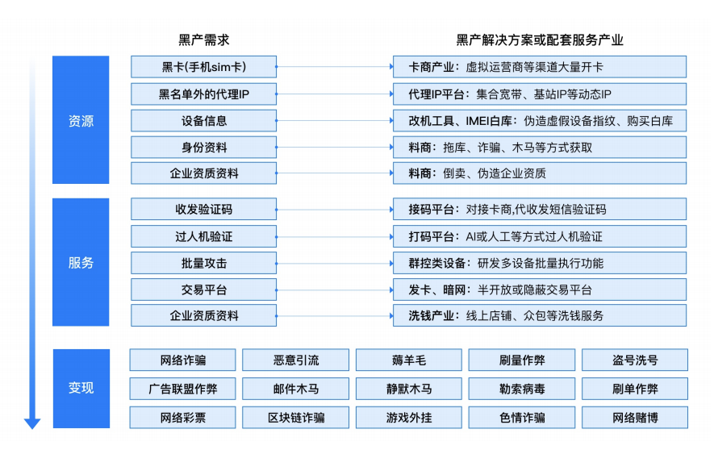

风控情报库：

```
（1）风险⼿机号识别——识别⼿机号是否是⿊灰产团伙所持有的虚假⼿机号或是被⿊产所劫持的真⼈号码
（2）动态风险IP识别——实时识别代理、秒拨、混拨、代理秒拨等动态的风险IP
（3）风险设备环境——识别群控、云控、箱控、云⼿机、模拟器、多开分身、Root越狱、设备调试、虚拟定位、挂机⾏为等30多种风险设备环境
```

## 二、黑产的演变趋势

### 1.商业模式转变带来黑灰产核心资源变化

黑灰产逐渐向移动互联网的场景转移

### 2.虚假账号的生产和流转呈规模化趋势

大量手机号在各个互联网核心业务场景注册恶意账号，并通过这些账号在业务场景中变现

#### （1）恶意注册的黑产

直播平台进行刷单，识别虚假账号的困难性

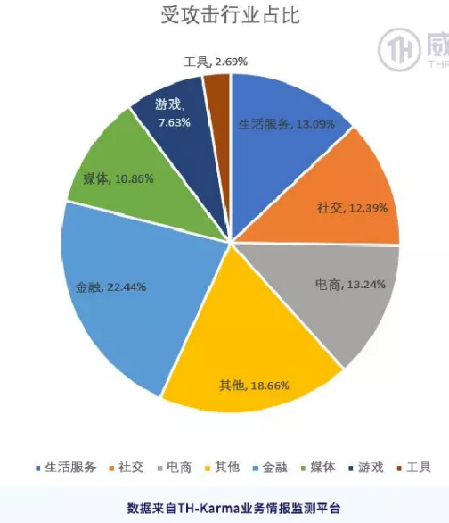

#### （2）恶意注册规模效率

大量的恶意账号注册远远大于解封，这导致了接码平台和发卡平台变得十分重要

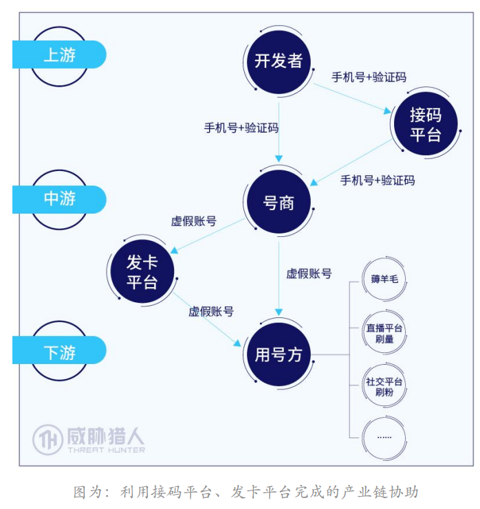

接码平台提升黑灰产的虚假注册效率

⿊灰产购买猫 池设备，再插上上百张⼿机卡来模拟上百个自然⼈，完成对业务场景的恶意注册。恶意注册完之后再把设备和电话卡转卖或者租用给另外⼀个⿊灰产团队用于不同业务场景的恶意注册。

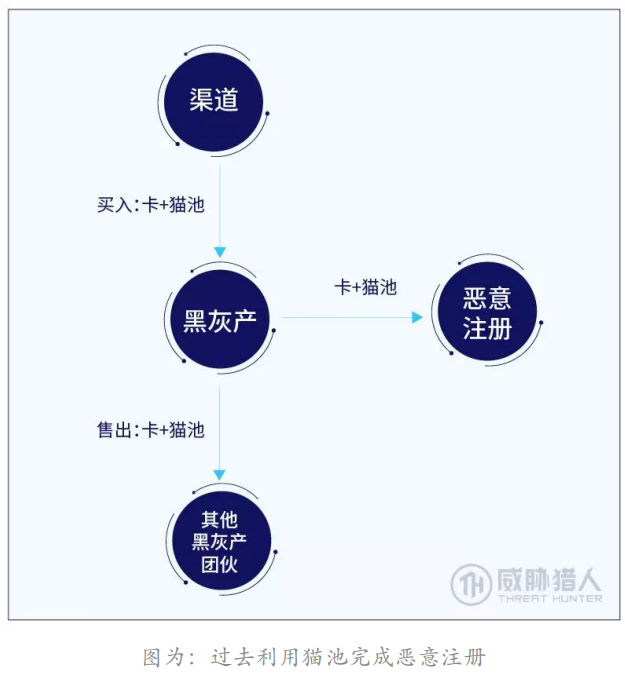

接码平台：⽕云、爱乐赞、ema666、60码、thewolf、⽟米等

随着验证码对抗的升级，注册项目不再是通过单⼀的短信验证，有些需要语音验证，有些则 需要⼆次验证，即需要注册用户使用注册的⼿机号向指定号码发送⼀条验证短信。

发卡平台提升黑产账号流转的效率

发卡平台是把数字商品做自动化交易的平台，在号商完成⼤量账号的注册后，他们会把恶意账号整理后集中在发卡平台中列出，供处在产业链下游的用号⽅直接线上批量采购。

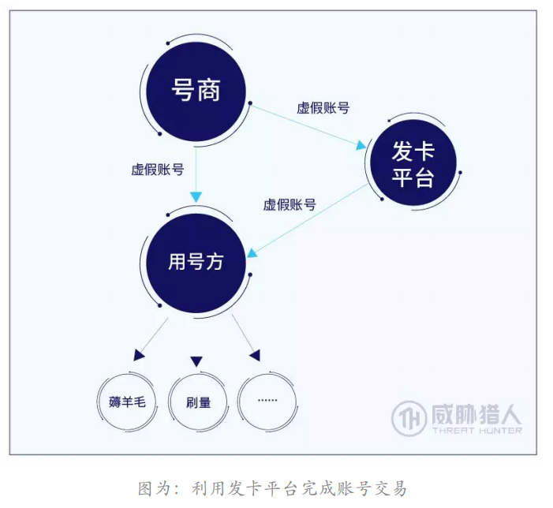

#### （3）企业对抗恶意注册的主要措施

**防控-及时捕获黑灰产行为**

<1>识别黑灰产资源：

⿊灰产在作恶和变现时都重度依赖于其⼿中持有的基础资源，包括但不限于⼿机号、IP、设备等。将这些数据与自身业务数据进行匹配，然后进行风险控制

<2>分析黑产工具：

通过逆向分析黑灰产的工具，来了解自身的一些逻辑漏洞和风控策略，再进一步进行防护

<3>监控黑灰产交易变化：

⿊灰产交易品类和价格的变动，能够反映出企业⼀定周期内风控策略的有效性。例如黑灰产交易的价格变高，说明企业风控产生了一定的效果

**预警-对虚假账号进行风险预警**

<1>新增的恶意注册项目:

对黑灰产实施恶意注册行为之前进行监控

<2>正在发生的恶意注册行为：

通过对黑灰产进行恶意注册时的工具方式进行刻画，然后进行还原攻击逻辑，提高风险控制

### 3.从自动化工具向真人众包演变

#### （1）黑产攻击趋势变化

现在的黑产攻击整合程度加深，集成接码、打码、宽带秒拨、⽹络代理等多个针对绕过业务安全风控节点的功能

#### （2）将攻击隐藏于正常用户行为中

黑产使用众包等方式将自身的行为变得正常化，使得难以检测

#### （3）黑产作恶方法的改变

**手机号的转变-短信拦截卡比例增高**

干净身份的手机号先进行高利润的恶意账号注册，完成后再进行低利润的恶意账号注册

短信拦截卡的比例不断增高

**真人作弊乱象-新客福利被黑会产和羊毛党恶意赚取**

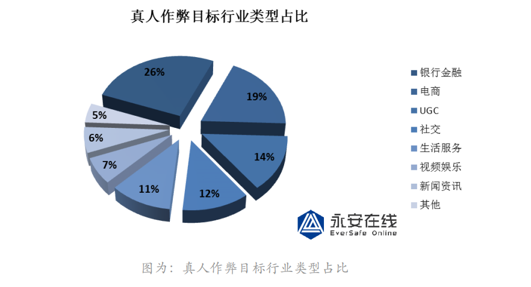

通过恶意注册来进行新人福利的薅羊毛

**刷量⽅式隐蔽升级-从假⾁鸡到真⾁鸡**

通过恶意注册然后使用分身工具和IP代理工具进行恶意的刷量，例如有⽹页⼴告采用隐藏浮层的⽅式进⾏刷量，有软件⼴告通过 恶意弹窗进⾏刷量，还有利用小众宽带进⾏宽带劫持弹窗刷量。

#### （4）新型黑灰产的应对方案

**拦截卡黑卡的作恶方式**

需要以“是否为持卡⼈本⼈操作”来区分是不是被⿊产利用，这需要根据拦截卡本身特点和使用拦截卡攻击过程中的特征进⾏判定：

1）通过自身业务场景设置判断规则

2）根据拦截卡的出现频次，以及⼿机⿊卡、⿊IP的命中次数进⾏判定

**真⼈众包作恶⽅式**

真⼈众包的作恶主要为通过发布众包任务的⽅式进⾏作恶，我们如果要应对的话首先需要知晓其作恶流程。

真⼈作弊的作恶可以通过情报维度和数据维度两个⽅面共同分析，对真⼈作弊帐号进⾏精准 的定位： 

```
（1）情报维度的信息，获知哪里记录了礼品最快领取流程，可以帮助我们直接抹去和⿊产之间 的信息差，并在最短的时间夺取主动权.
（2）数据维度可以用是否有异地登陆、异地登陆设备等特征去进⾏复合判断，以发现⿊产动作特征，及时发现被⿊产控制的帐号。
```

**刷量方式的应对措施**

对于广告投放商来说：通过统 计代码自带的页面统计功能发现恶意刷量的⾏径：

```
1）通过停留时长发现刷量的请求
2）可以通过对IP的检测发现是否是来自于刷量⼯作室的访问，从⽽清洗出相对⼲净的用户访问列表。
```

社交平台的刷量解决方案：结合真⼈作弊的定位⽅式进⾏分析，通过情报维度和数据维度发现被⿊产控制进⾏刷量的帐号，然后根据特征进⾏⼀⽹打尽

```
1）情报维度的信息，通过了解⿊产可以进⾏刷量的操作点，对相关环节进⾏监控，拦截来自 恶意⼿机卡和恶意IP的请求。
2）数据维度可以用是否有异地登陆、异地登陆设备等特征去进⾏复合判断，以发现⿊产动作特征，及时发现被⿊产控制的帐号。
```

### 4.真人作弊深度剖析

真人作弊是现在黑灰产中最难对抗的情况，主要原因：

```
（1）真⼈作弊⿊灰产经过数年发展，模式和形态越发多元和丰富，已渗透⾄众多场景、众多⾏业
（2）真⼈作弊⿊灰产发展迅猛，自2014年⾄2020年，真⼈作弊平台（app）的数量在增长了近40倍，参与⼈数增长了近百倍
（3）相较于机器作弊，真⼈作弊对甲⽅的风控和安全能⼒提出了更⾼的要求，带来了新的挑战
（4）以情报能⼒和数据能⼒为风控赋能，是识别新型欺诈模式的有效⽅式⽅法
```

#### （1）发展现状

多行业、多场景、多任务广泛渗透

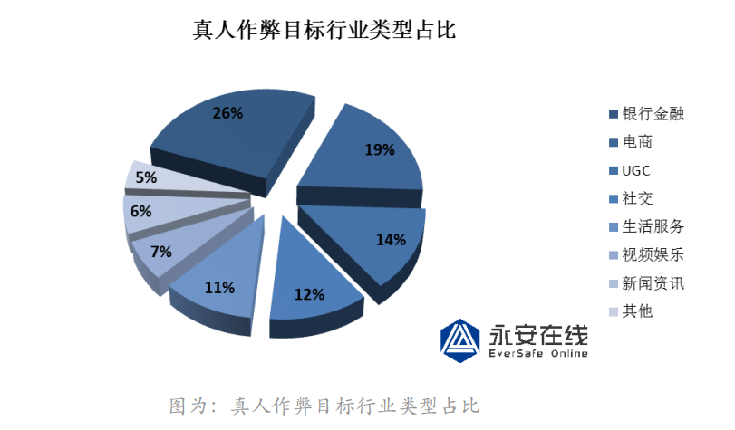

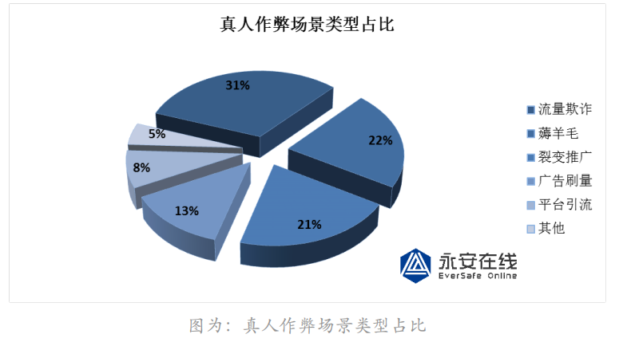

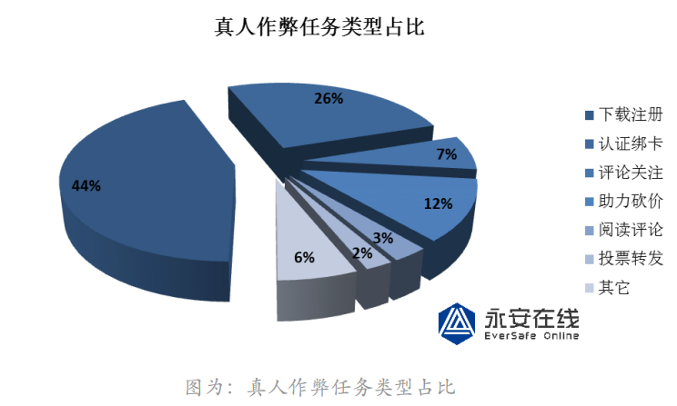

真人作弊主要关注的任务是：下载注册、认证绑卡、评论关注

#### （2）痛点和危害

**真人作弊vs机器作弊**

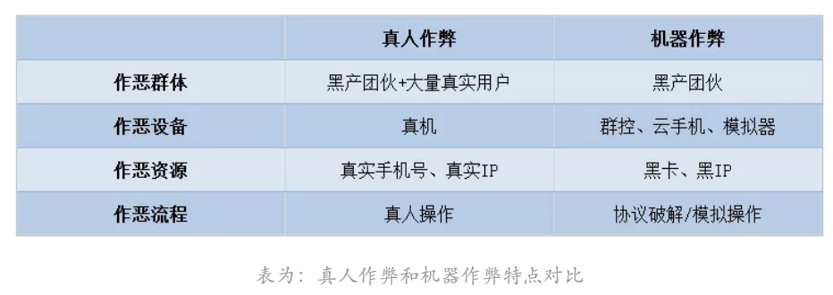

**真人作弊vs传统风控**

传统风控更加倾向于黑产的特征进行检测，难以应对真人作弊：

<1>防护手段失效

⽆论是规则层面的风险数据库、风险规则库、风险特征库等，还是模型层面的AI算法、决策引擎等，其知识的积累主要来自于长期对机器作弊的数据分析与沉淀。真人作弊的途径难以查寻，所以难以进行防护。

<2>处置边界模糊

处置违规的真实账号难度增强。

<3>风险响应滞后

从真人作弊风险事件发生，到最后产生影响，出现对抗方案，这个周期太长

<4>溯源复盘困难

难以对真人作弊进行溯源

**真人作弊的额外风险**

真⼈作弊还引⼊了个⼈信息被⿊产滥用和泄露的风险

⿊产收购真⼈用户注册的账号，用于不法用途。⿊产诱导真⼈用户协助完成好友辅助认证、 实名、⼈脸认证等，真⼈用户不但违反平台用户条款，甚⾄还需承担潜在的法律风险。例如认证绑卡风险，用户获得佣金，但是黑产可能拿用户信息进行获利。

#### （3）对抗和解决

情报能⼒和数据能⼒为风控赋能，是对真⼈作弊新型欺诈模式的解决办法。

**情报维度**

首先人工对多家的真人作弊平台进行特征的统计，比如统一的密码，包括密码特征、任务发布者信息、任务最早开始时间等等，然后第⼀时间把这些关键信息交给了该社交平台，然后进行溯源和定位。

**数据维度**

真⼈作弊相关的风险数据包括：风险APP、风险设备、风险账号以及真⼈作弊中 任务的⼆维码、链接、教程、任务流程等等。

对真⼈作弊用户进⾏了风险设备的定位以及信息提取⼯作，另外也把这些风险设备、任务分享链接和结算链接等数据特征交付给了该支付平台。然后对这些账号进行共性分析，来进一步确定特征，然后进一步的溯源

## 三、攻防技术的迭代

### 1.黑产群控进化史

#### （1）群控&箱控

群控，是⼀种通过操作多台⼿机进⾏批量攻击的⽅式，可以说是⿊产⼯作室的刚需，在市场需求的催⽣下，群控类设备的供应商都非常擅长与利用各类技术对其进⾏升级优化。


箱控的内部构造。将⼗⼆台安卓⼿机的屏幕拆掉，把主板通过电路集成⽅式集成⾄⼀块⼤主板，进⾏统⼀供电和管理

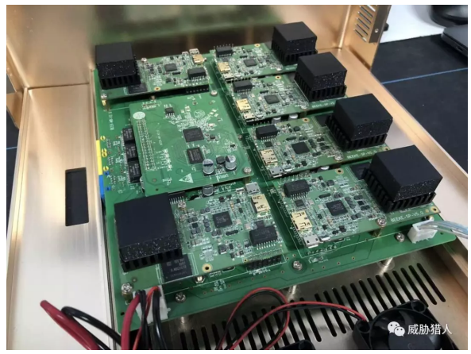

⾄于设备数量问题，它通过切割内存的⽅式，将每个⼿机主板切割为⼗个分身。最终达到，操作⼀台箱控相当于操作⼀百⼆⼗个不同⼿机的观感。

⿊产常常需要通过模拟点击的⽅式伪装正常用户操作，达到攻击目的。见的模拟点击⽅案是通过识别颜⾊、⽂字、形状来定位到需要点击的坐标，这种⽅式经常需要进⾏容错判断，箱控使用了appium。

#### （2）黑产进化、优化攻击效率和成本

**重度依赖黑产基础资源**

在⿊产市场，像设备这样需求庞⼤⽽稳定的“资源”还有很多：IP、身份证、银⾏卡、支付账 号、改机⼯具、自动化攻击软件、过滑动验证码、隐秘变现渠道等。

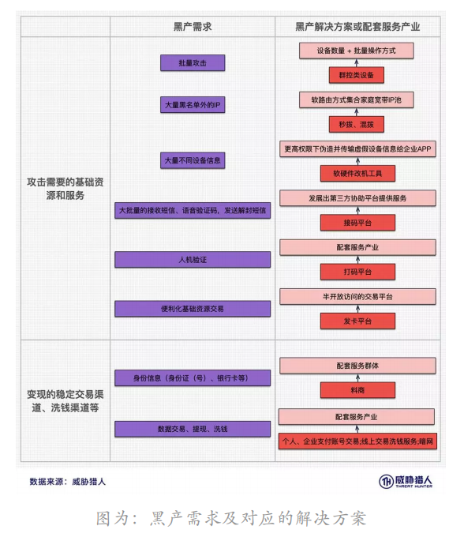

#### （3）黑产解决批量攻击的方式

**箱控**

优化点：将通用类的攻击⼯具打包配套提供服务，降低了攻击的操作门槛

将通用类的攻击⼯具打包配套提供服务，降低了攻击的操作门槛，黑产将很多功能进行集成：VPN功能、改机功能、虚拟定位功能、云端备份功能等，降低黑产攻击的门槛

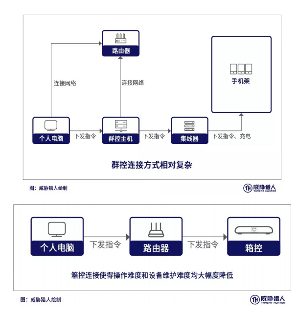

**租赁模式-“云⼿机”**

优化点：租赁模式，自由“扩容”，降低了维护设备成本，且⽅便备份传输设备信息

“云⼿机”是⼀种攻击设备租用模式，操作者可以通过客户端或浏览器直接对远端的⼿机（或虚拟⼿机）进⾏操作，发起攻击。

**中控**

优化点：解决了传统群控因数据线传输屏幕数据和指令数据造成的设备数量限制问题。 

⼿机设备中安装客户端，用户在PC端客户端上统⼀管理⼿机并向其下发命令，由⽹络传输 后⼿机客户端执⾏模拟点击完成攻击。 

**云控**

优化点：设备⽆需在同⼀地点，脚本命令存储在云端，团伙间交易脚本时⽆需发送源码，⽅便了脚本传播和管理⼤量⼿机 

⼀个⼴域⽹版本的“中控”，操作者通过任意浏览器对⼿机进⾏管理和下达命令。

**群控**

优化点：早期的批量操作设备解决⽅案，在脚本开发上限制较多，为避免卡顿，设备数量限制在百台左右。

采用屏幕映射的⽅式将⼿机屏幕映射到电脑，通过集线器将⼿机与电脑通过数据线连接，从⽽传出屏幕内容和操作指令。 

#### （4）攻防建议

企业可通过反欺诈情报（事前预防，事后根据攻击⽅法找到防护点）+欺诈数据标签（定位攻击流量）的综合对抗，填补认知盲区，打平信息差，了解对⽅的目标、攻击思路和策略。

⿊产有庞⼤的上游基础资源供应，但同时也非常依赖这些资源，这些是产业链的关键结点，也同时是我们识别、打击和防护的有 效结点。

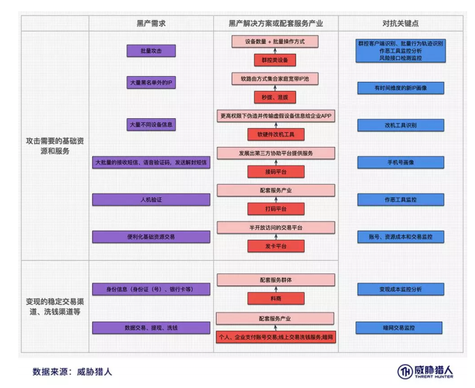

**反欺诈情报——业务安全攻防中的隐性⼒量**

反欺诈情报⼀般包括：⿊产准备攻击的接⼝、所涉及到的交易平台、攻击的目标接⼝、所利 用的攻击⼯具、所涉及到的相关资源（⼿机号、IP）等。通过这些节点的布控，可以有效的在⿊产资源准备时就及时发现风险，并了解⿊产的攻击路径和逻辑，提前做好风控策略。

**欺诈数据标签——⾼效落地的判别⽅案**

可以针对这些⿊灰产做恶的虚假账号进⾏直接的拦截或降权。从⿊产基础资源识别的风控⽅式，能够⼀定程度上降低风控的误判率并提⾼可解释性。

### 2.黑产IP资源进化史

秒拨IP资源早已成为当下主流的⿊产IP资源

#### （1）秒拨IP

自从甲⽅开始在IP层面根据⼀些简单的规则（如设定单位时间内IP的访问次数阈值、限制触 发特定⾏为的IP等）做风控起，就正式向⿊产在IP战场上宣战。

代理IP不适合黑产大规模批量化的攻击，不少甲方开始积累代理IP池，进一步打压了黑产使用代理IP的效果

秒拨的底层思路就是利用国内家用宽带拨号上⽹（PPPoE）的原理，每⼀次断线重连就会获取⼀个新的IP。与时俱进的⿊产掌握⼤量宽带线路资源，利用虚拟化和云计算的技术整体打包成了云服务，并利用ROS(软路由)对虚拟主机以及宽带资源做统⼀调配和管理。黑产用户可以控制云主机，部署自动断线重连切换IP以及攻击的⼯具后。

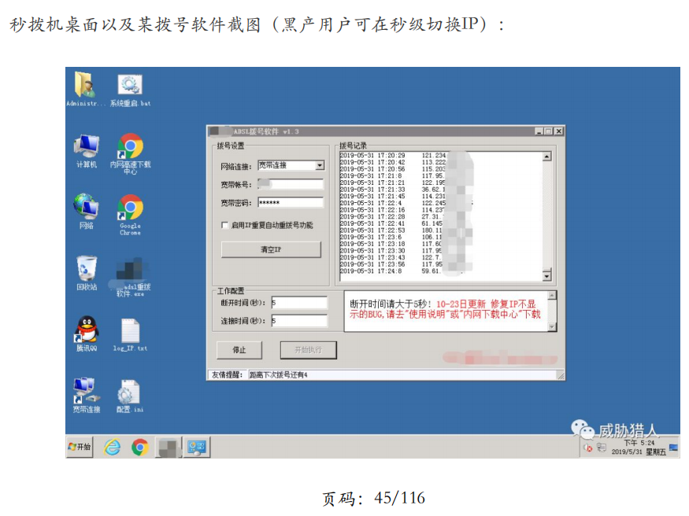

秒拨的优势：

```
（1）IP池巨⼤：假设某秒拨机上的宽带资源属于XX地区电信运营商，那么该秒拨机可拨到整个XX地区电信IP池中的IP，少则⼗万量级，多则百万量级；
（2）秒拨IP难以识别：因为秒拨IP和正常用户IP取自同⼀个IP池，秒拨IP的使用周期（通 常在秒级或分钟级）结束后，⼤概率会流转到正常用户⼿中，所以区分秒拨IP和正常
用户IP难度很⼤。
```

⿊产对秒拨还做了升级，称为“混拨”，即⿊产把多个省市地区的秒拨资源打通，实现在单台秒拨机上就可以拨到全国上百个地区的IP资源。

#### （2）攻防建议

秒拨已然成为支撑⿊产与甲⽅在IP层面攻防的核⼼技术，也是当下业务安全⾏业的痛点之⼀。

识别风险IP的核⼼依据应该是，该IP是否当下被⿊产持有，IP的⿊产使用周期和时间 有效性这两个指标尤为重要，尤其是对于像家庭宽带IP、数据中⼼主机IP这种“非共享型”的IP。针对基站、专用出⼝等“共享型”的IP，由于单个IP背后会有⼤量用户，风控阈值应该相 对更宽松，但是如果能准确识别IP是否当下被⿊产使用，也能提供很重要的参考价值。通过对⿊产ROS秒拨节点的布控，可实时监控和收集⿊产当下使用的秒拨IP。

### 3.秒拨IP识别技术案例

IPv6的普及，无疑给黑产带来了巨大的空间，可以极大的扩大了自己的ip地址资源，而且现在秒拨也增加了对IPv6的支持

#### （1）黑灰产已经开始利用IPv6资源

从早期的通过代理IP饶过风控规则的方式，到现在已经演化出“秒拨”“混拨”等，甲方的对抗策略在IPv4的环境下也有相应的提升和积累

IPv4向IPv6过度过程中，企业需要考虑的问题：

海量的地址扫描、黑名单库失效、未知下的误判等

现目前黑灰产掌握的主要IP资源中都存在IPv6的踪迹：

**代理**

由于当前IPv6普及率还较低，IPv6 代理商并不是直接提供IPv6地址和端⼝，提供的依旧是IPv4和端⼝，通过类似6in4加IPsec的 隧道协议，将IPv6数据包封装在IPv4数据包中。

**秒拨**

秒拨IP是⿊灰产掌握的另⼀主要IP资源，现在已有部分秒拨厂商开始支持并提供IPv6的服务，而且IP池庞⼤到接近⽆限，并且IP地址更难以识别

<1>无限IP池

监测到的10万数据中⼏乎不存在重复的IPv6地址，⽽实际的IPv6秒拨池中，远不⽌这个数。这意味着，传统的利用IP⿊名单库给IP打风险标签的⽅式将不再适用。 

<2>秒拨IP难以识别

由于秒拨IP和正常用户IP存在于同⼀个IP池，每次断开连接，原本属于被⿊产使用的秒拨IP，都有可能在下⼀次拨号的时候流⼊到正常用户⼿中，这会给秒拨IP和正常IP的区分带来非常⼤的难度。

#### （2）攻防建议

针对IPv6的攻击手段进行提前的研究，以往以后的攻击

### 4.新工具“IP魔盒”案例分析

#### （1）IP魔盒

IP魔盒⼀款比⼿掌还小的硬件盒⼦，USB接⼊后，可以使普通PC拥有基站IP，IP魔盒的特征：

```
1) 关联用户多：⼀个基站IP背后会关联着⼤量的用户群体，如果对IP进⾏拦截，极易误杀正 常用户，影响用户体验，导致用户流失。
2) 切换IP简单：仅需要通过打开关闭飞⾏模式，即可实现IP切换。
2）切换IP简单：仅需要通过打开关闭飞行模式，就可以实现IP切换
3) 成本较低：据我们统计⼀般全国物联⽹卡，开卡价格为4-6元，10G流量价格仅需要15元。
4) 海量IP池：经测试⼀张全国物联⽹卡可以获取⾄少17个段的IP，且分布在不同的地区。
```

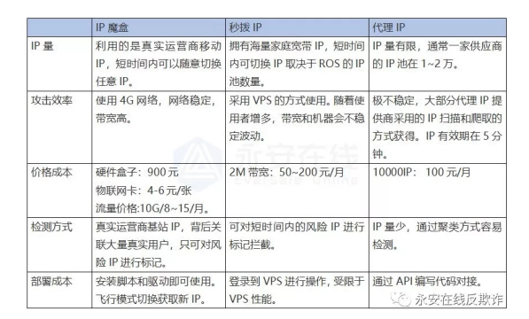

### 5.定制化的ROM改机案例分析

⿊产改机的⼿段主要有安卓模拟器、改机⼯具、应用多开/分身。

#### （1）定制ROM改机的技术原理

简单来说就是通过修改Android系统源代码，在底层直接修改并返回设备参数。这种修改是 全局的，即可以对所有的应用进程和shell进程都⽣效。

**修改机型信息：**

我们以修改机型信息为例，获取机型信息⼤多会调用_system_property_get这个函数，位于/system/lib/libc.so这个系统库中。


我们发现开发者对init进程做了深度定制，最终是在init中修改了机型信息

**修改IMEI：**

获取IMEI信息通常会调用getDeviceID函数。这是⼀个phone服务的IPC调用，响应代码位于：packages/services/Telephony/src/com/android/phone/PhoneInterfaceManager.java中

根据IPC调用发起⽅的UID(可以看作⼀个用的唯⼀标识)，来判断是否需要修改 IMEI。如果是，则调用getHookValue返回伪造的IMEI。为了⽅便使用，作者提供了设置接 ⼝，可以在使用前设置哪些应用需要修改IMEI。

#### （2）定制ROM改机的使用

还可以将定制化改机ROM变的更为简单：

```
1）可镜像备份机型数据环境⾄云服务器，⽅便账号对应的设备环境管理；
2）打通系统调试接⼝，⽅便自动化脚本编写、降低开发成本；
3）傻瓜式⼀键式操作，完成设备信息修改、设备数据恢复。
```

定制ROM改机运⾏流程如下图所示：

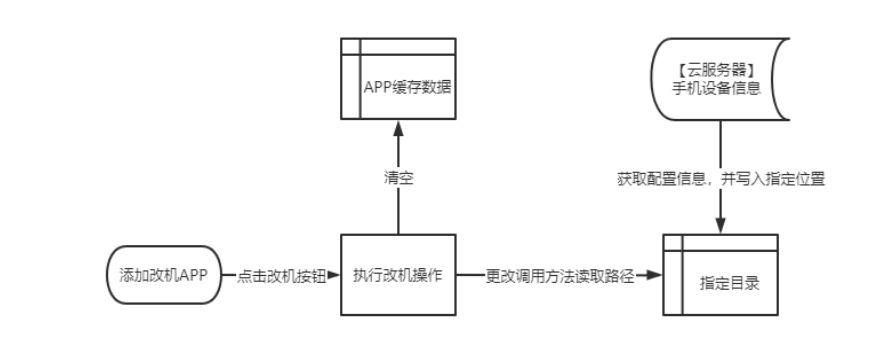

实现批量化引流

#### （3）定制ROM改机的检测

需要深入结合改机工具的实际运行原理和运行过程，找到相应的攻击面，这样才能实现对改机工具的反制

### 6.黑产攻击流程自动化体系

从攻击⾏为来看，批量注册，批量薅⽺⽑，刷量，刷单，引流等，往往需要操控⼤量的账 号，因此对自动化攻击的依赖性更强：

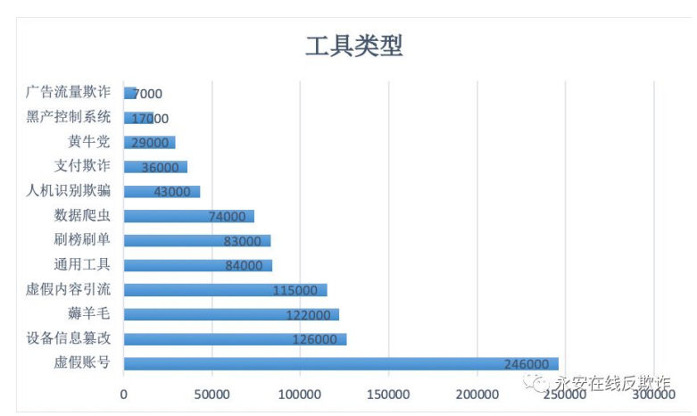

#### （1）黑产资源高度集成自动化攻击流程

**API接口**

⿊产资源平台为了⽅便，最典型的⽅式的是提供API接⼝，这样便可以在自动化脚本或程序 中直接调用。以接码平台为例，提供的API接⼝主要有两个，取⼿机号和取验证码。

```
http://api. xxxxxx .com/api/do.php ? action=getPhone
```

由于各个接码平台API接⼝除了域名外，参数格式都⼤同小异，所以可以通过定义⼀些正则表达式，从流量中（比如我们的蜜罐流量）捕获接码平台的API接⼝访问流量，从⽽可以⼤致掌握全⽹的接码平台数量和规模

还有一些过码平台提供API接口

**功能模块**

很多黑产工具使用易语言编写模块，十分的简洁，而且可以进行模块化集成

**提供环境**

秒拨相比于代理IP，除了价格更低，还可以结合自动化攻击

```
1）启动秒拨的客户端程序，开启自动拨号，然后执⾏自动化攻击：
2）将自动化攻击的脚本或程序运⾏在秒拨VPS中，秒拨VPS提供自动拨号的功能：
```

**集成系统**

集成的黑产工具系统，例如某款箱式群控：

```
1）VPN拨号功能，可以⽅便的切换IP；
2）虚拟定位功能，可以⽅便的修改定位，从⽽实现虚假出⾏订单或站街招嫖；
3）改机功能，可以⽅便的修改IMEI，IMSI等硬件参数，从⽽伪造更多设备；
4）主流的移动端App自动化操控脚本，比如微信自动加好友，自动加群，自动发朋友圈， 抖音自动关注，自动点赞，自动发表评论等；
5）云端备份功能，可以将整套攻击环境连同环境上登录的账号⼀并上传备份，通过还原快 照的⽅式切换环境，从⽽进⾏⼤量攻击。
```

#### （2）自动化攻击的技术手段和攻防对抗

⿊产实现自动化攻击，主要通过2种技术⼿段：协议破解/伪造，以及模拟点击/操控。

**协议破解/伪造**

协议破解/伪造指的是通过抓包+逆向分析等⽅式，获取到客户端跟服务端通信的请求接⼝以及参数，直接伪造接⼝协议和参数来完成自动化操作

破解了协议后，可以写自动发帖机，一些参数进行随机值的校验

由于协议破解/伪造脱离了环境和设备的限制，⿊灰产可以用很低的成本完 成批量化规模化作案，因此危害也更加严重。

**模拟点击/操控**

<1>按键精灵

按键精灵是⼀款⼤家非常熟悉的老牌自动化脚本⼯具，也是目前⿊产使用最为普遍的通过模 拟点击实现自动化攻击的⼯具。

<2>Auto.js

优势：

```
1）设备⽆需Root，使用成本更低，⽽且可以躲避基于Root的风险设备环境检测； 2）按键精灵基于识别图片、颜⾊、坐标等实现模拟操作，存在分辨率的兼容问题，⽽
Auto.js可以直接操作控件，自动适配各种安卓机型，稳定性更⾼；
3）使用Auto.js开发打包⽣成的apk⽂件体积更小。
```

Auto.js脚本开发者可以使用Visual Studio Code + Auto.js插件开发脚本，电脑连接⼿机终端，可直接控制装有Auto.js客户端的⼿机执⾏脚本，也可将脚本保存⾄⼿机终端，编译为APK， 运⾏APK执⾏操作\

移动端的模拟点击/操控类攻击，需要在设备上运⾏被攻击的移动端应用

批量化攻击的对抗：

```
如果要实现批量化规模化攻击，需要有⼤量的设备资源（群控、云控、箱控，或者通过 模拟器/改机⼯具伪造设备资源），因此对于厂商来说，可以从设备环境层面进⾏风险检 测。⽆论是使用按键精灵、Auto.js、改机⼯具、GPS伪造等⼯具，还是模拟器、群控等设备环境，可从设备指纹数据中找到蛛丝马迹，设备指纹除了用作唯⼀性标识之外，还应该对基本的应用多开、改机环境/环境伪造、Hook⾏为、Root/越狱、代理/VPN等风险场景有识别能⼒。如果具备较强的情报能⼒，可以尽可能多的收集自动化攻击脚本程序，并在应用启动的时候检测安装列表（Applist）中是否存在这类程序。
```

模拟点击的对抗：

模拟点击/操控类攻击虽然会模仿正常用户的操作⾏为，但与用户实际的⾏为特征还是会存在差异，可以从 ⾏为层面做检测

比如针对某电商平台刷店铺访问量的⼯具，每⼀次刷量⾏为⼀定会包含“打开首页”、“搜索目标店铺的商品关键词”、“先进⼊两家同类商品的店铺浏览商品”（模仿正常用户货比三家 的习惯）、“在进⼊目标店铺浏览商品完成刷量”，并且在每个页面的停留时间也在固定的。

从业务数据中提取用户关键⾏为做特征进⾏聚类分析，可以有效识别程序化的模拟操作

#### （3）攻防的建议

设备的风险检测：

```
1） 对业务运⾏的设备环境进⾏检测。⿊灰产⽆论是在设备信息欺骗上，运⾏自动化脚本⼯ 具，都需要使用⼀些特殊的运⾏环境。这些环境通过分析⼀般都能找到⼀些通用的检测点。 比如改机⼯具，可以对Hook框架进⾏检测，模拟点击可以检测系统参数。这些都可以作为 可疑设备特征进⾏加权打分。
2） 对业务上的用户⾏为识别。⿊产自动化通常会用到的协议模拟技术和模拟按键技术，这都跟自然⼈的操作路径会有巨⼤的差距。比如当用户登录时，账号密码的输⼊不会是瞬间完成的，又或者每次按钮的点击，也不会在相同位置。这些都可以作为检测特征，当我们对用 户操作⾏为进⾏识别，这⼤⼤增加了⿊灰产的对抗成本。
```

## 四、黑产工具情报分析

### 1.⼯具样本的快速分析和有效性验证

不容易⼿动执⾏并复现功能的原因主要有以下⼀些:

```
1) 缺少⼯具运⾏的环境，比如.net 编写的⼯具需要.net的运⾏时环境，XPosed 程序需要 XPosed 框架等; 
2)缺少⼯具运⾏所依赖的⼀些组件，主要出现在部分 PC 端⼯具样本，在运⾏时需要⼀些其 他的动态库(DLL)支持;
3)⼯具运⾏时会检测虚拟机环境，导致在虚拟机中运⾏不起来，主要出现在 部分 PC 端⼯具样本
4)⼯具需要激活或注册才能够使用，对于这种情况，可以尝试联系作者进⾏购买，或者通过 破解等⼿段绕过激活或注册，直接进⼊⼯具主界面;
5)⼯具执⾏相应功能时，缺少需要的资源⽂件，比如部分⼯具在执⾏批量回复、点赞、关注等操作时，需要读取本地的账号资源⽂件;
6)⼯具执⾏相应⼯功能时，需要购买⿊产平台的资源，比如注册机类⼯具，往往需要先在接码平台注册账号并充值，然后在⼯具运⾏时填⼊接码平台的账号密 码;
7)⼯具执⾏的流量比较复杂，有的需要按照⼀定的步骤⼀步步执⾏，有的需要先执⾏⼀些前置操作。对于这类⼯具往往得先找到教程并按照教程来执⾏等。
```

**移动端工具的分析**

<1>⼯具的包名

通过工具的包名进行过滤

<2> ⼯具的源代码

⼤多数移动端⼯具都可以在情报平台上下载通过⼀定技术⼿段还原出来的源代码。直接阅读源代码可以清晰的了解⼯具的运⾏原理，依赖的资源，执⾏的步骤等。

## 五、总结

本文参考于《永安在线-2021年黑灰产行业研究及趋势洞察报告》，微信公众号回复：永安黑灰产报告，自取。简易的思维导图上传至知识星球：安全后厨。

