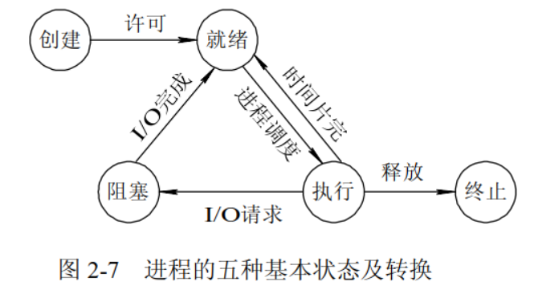
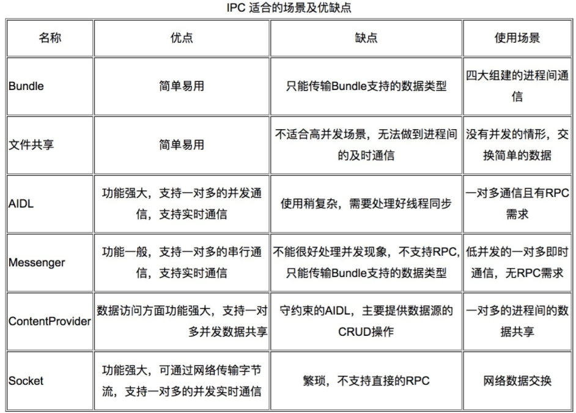
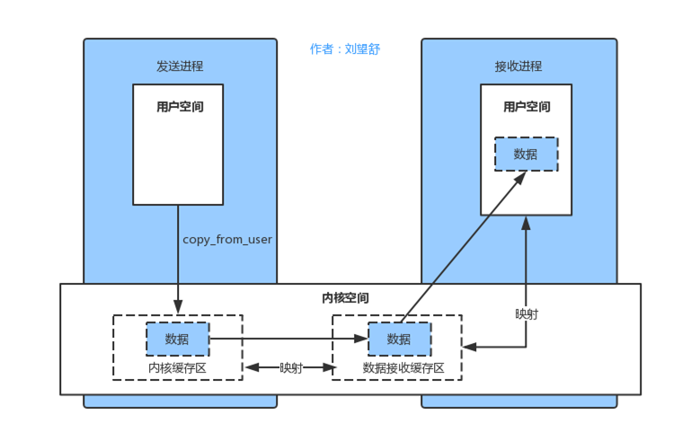
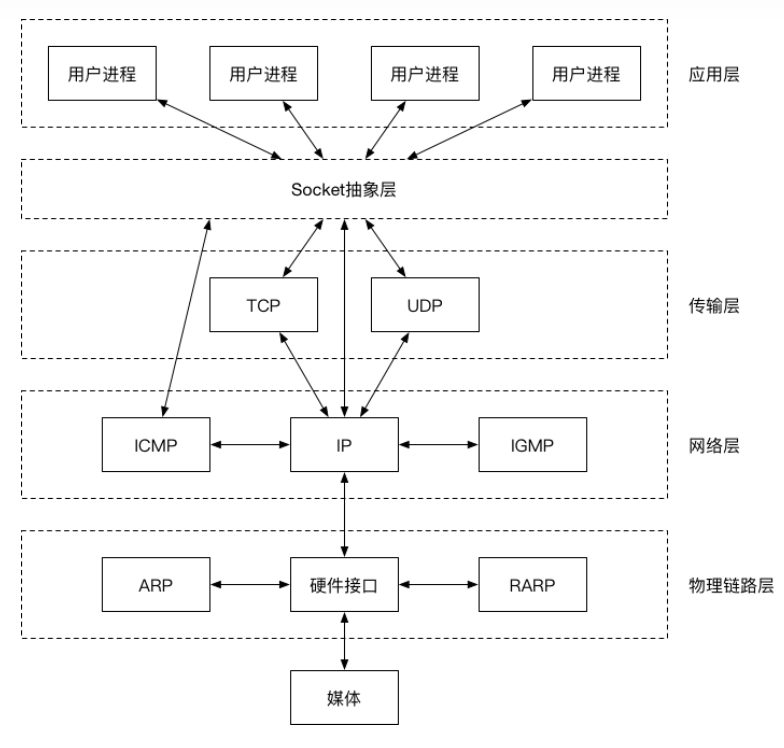
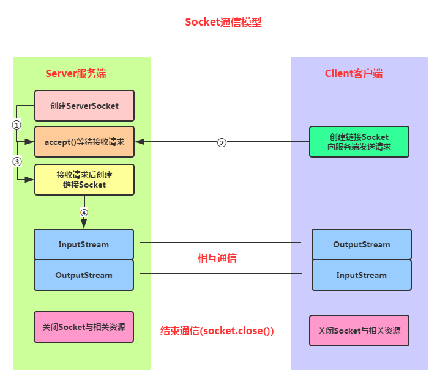

# 计算机操作系统面试——移动安全（Android方向）

## 一、前言

移动安全（Android）方向在计算机操作系统中主要考察第二章《进程与线程》，所以大家将主要精力放在第二章即可，本文只针对在移动安全面试中可能出现的高频考点。详细的知识点解释，进入星球，有计网+操作系统+数据结构+密码学的详细的pdf

## 二、考点集合

### 1.进程与线程

#### （1）进程与线程的区别？

- 进程（Process）是系统进行资源分配和调度的基本单位，线程（Thread）是CPU调度和分派的基本单位；
- 线程依赖于进程而存在，一个进程至少有一个线程；
- 进程有自己的独立地址空间，线程共享所属进程的地址空间；
- 进程是拥有系统资源的一个独立单位，而线程自己基本上不拥有系统资源，只拥有一点在运行中必不可少的资源(如程序计数器,一组寄存器和栈)，和其他线程共享本进程的相关资源如内存、I/O、cpu等；
- 在进程切换时，涉及到整个当前进程CPU环境的保存环境的设置以及新被调度运行的CPU环境的设置，而线程切换只需保存和设置少量的寄存器的内容，并不涉及存储器管理方面的操作，可见，进程切换的开销远大于线程切换的开销；
- 线程之间的通信更方便，同一进程下的线程共享全局变量等数据，而进程之间的通信需要以进程间通信(IPC)的方式进行；

#### （2）进程间的通信方式有哪些?

- 管道(Pipe)
- 命名管道
- 消息队列
- 信号(Signal)
- 共享内存
- 信号量(Semaphore)：初始化操作、P操作、V操作；P操作：信号量-1，检测是否小于0，小于则进程进入阻塞状态；V操作：信号量+1，若小于等于0，则从队列中唤醒一个等待的进程进入就绪态
- 套接字(Socket)

#### （3）进程有几种状态？



创建状态：进程在创建时需要申请一个空白PCB，向其中填写控制和管理进程的信息，完成资源分配。如果创建工作无法完成，比如资源无法满足，就无法被调度运行，把此时进程所处状态称为创建状态

就绪状态：进程已经准备好，已分配到所需资源，只要分配到CPU就能够立即运行

执行状态：进程处于就绪状态被调度后，进程进入执行状态

阻塞状态：正在执行的进程由于某些事件（I/O请求，申请缓存区失败）而暂时无法运行，进程受到阻塞。在满足请求时进入就绪状态等待系统调用

终止状态：进程结束，或出现错误，或被系统终止，进入终止状态。无法再执行

#### （4）Android中的进程通信方式？

Android中的通信方式一般包括文件、AIDL、Binder、Messenger、ContentProvider、Socket



其中AIDL、Messenger、ContentProvider都是基于Binder，所以我们着重了解Binder和Socket的通信方式

#### （5）Android中的Binder原理？

Binder是一种进程间通信机制，在Android中我们所使用的Activity，Service等组件都需要和AMS(system_server) 通信，这种跨进程的通信都是通过Binder完成。

这里应用刘舒望大佬的一章图



Binder在不同层面表现的含义不同：

```
机制：Binder是一种进程间通信机制。
应用层：Binder是一个能发起通信的Java类。
底层：Binder是一个虚拟物理设备驱动。
```

Binder与传统的IPC机制对比：

| **Binder** | **共享内存**                         | **Socket**                               |                                                      |
| ---------- | ------------------------------------ | ---------------------------------------- | ---------------------------------------------------- |
| 性能       | 需要拷贝一次                         | 无需拷贝                                 | 需要拷贝两次                                         |
| 特点       | 基于C/S架构，易用性高                | 控制复杂，易用性差                       | 基于C/S 架构 作为一款通用接口，其传输 效率低，开销大 |
| 安全性     | 为每个APP分配UID，同时支持实名和匿名 | 依赖上层协议，访问接入点是开放的，不安全 | 依赖上层协议，访问接入点是开放的，不安全             |

Binder如何跨进程，实现依次Copy：

在Binder中，内核空间和进程2中分别另外开辟了一块虚拟内存，这两块虚拟内存指向物理内存中的同一块内存空间。然后传递数据的时候，将数据从进程1的物理内存1中复制到内核空间和进程2共同指向的物理内存块中，这样进程2就获得了数据，这样就实现了一次copy

#### （6）Android中的Socket通信？



Socket 是对传输层TCP/UDP协议簇的封装，封装为几个简单的接口，供应用层调用实现进程在网络中的通信

Socket的通信过程：



实现步骤：

```
Step 1：创建ServerSocket和Socket

Step 2：打开连接到的Socket的输入/输出流

Step 3：按照协议对Socket进行读/写操作

Step 4：关闭输入输出流，以及Socket
```

这里我们着重关注APP通信时，Socket在抓包防护中的安全问题，我们知道很多APP可以通过Socket进行通信，我们只需要定位相应API进行hook，就可以成功抓包

```
Java层Tcp: hook点 socketRead0、socketWrite0
Java层Udp: hook点 sendtoBytes、readBytes
Java层SSL：hook点 NativeCrypto.SSL_write、NativeCrypto.SSL_read 
ConscryptFileDescriptorSocket$SSLOutputStream.write、ConscryptFileDescriptorSocket$SSLOutputStream.read
Jni层Tcp: hook点 recvfrom、sendto
Jni层Udp: hook点 recvfrom、sendto
Jni层ssl：hook点 read、write
```

更新待续（目前总结国内10所大厂的面试考点涉及相关，有后续继续更新）

## 三、推广

后续会整理最新的各个大厂的面试题库，并进行更新，面试宝典中详细的文档资料存放在知识星球，欢迎加入知识星球：《安全后厨》，与各个大佬一起学习移动安全


